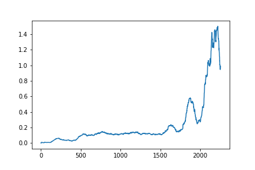

[//]: # (Image References)

[image1]: https://user-images.githubusercontent.com/10624937/43851024-320ba930-9aff-11e8-8493-ee547c6af349.gif "Trained Agent"
[image2]: (.tennis.gif) "Crawler"

# Project 3: Collaboration and Competition
In this project we solve the [Tennis]([https://github.com/Unity-Technologies/ml-agents/blob/master/docs/Learning-Environment-Examples.md#tennis](https://github.com/Unity-Technologies/ml-agents/blob/master/docs/Learning-Environment-Examples.md#tennis)) environment using a MADDPG Agent. The agent the tenniss racket to hit the ball over the net.

![Trained Agent][tennis.gif]

## Getting Started

To get started you will need to clone this project into a directory of your choice and install a the preequsits

### Prerequisites

In order to run this code you wil need to install the dependancies within the requirments.txt file.

`pip install -r requirements.txt`

## Enviroment

In this environment, two agents control rackets to bounce a ball over a net. If an agent hits the ball over the net, it receives a reward of +0.1. If an agent lets a ball hit the ground or hits the ball out of bounds, it receives a reward of -0.01. Thus, the goal of each agent is to keep the ball in play.

The observation space consists of 8 variables corresponding to the position and velocity of the ball and racket. Each agent receives its own, local observation. Two continuous actions are available, corresponding to movement toward (or away from) the net, and jumping.

The task is episodic, and in order to solve the environment, your agents must get an average score of +0.5 (over 100 consecutive episodes, after taking the maximum over both agents). Specifically,

-   After each episode, we add up the rewards that each agent received (without discounting), to get a score for each agent. This yields 2 (potentially different) scores. We then take the maximum of these 2 scores.
-   This yields a single  **score**  for each episode.

The environment is considered solved, when the average (over 100 episodes) of those  **scores**  is at least +0.5.

## Instructions
To train the agent, run all the cells within [Tennis.ipynb](Continuous_Control.ipynb)

## Results 

## Acknowledgments

* Udacity
